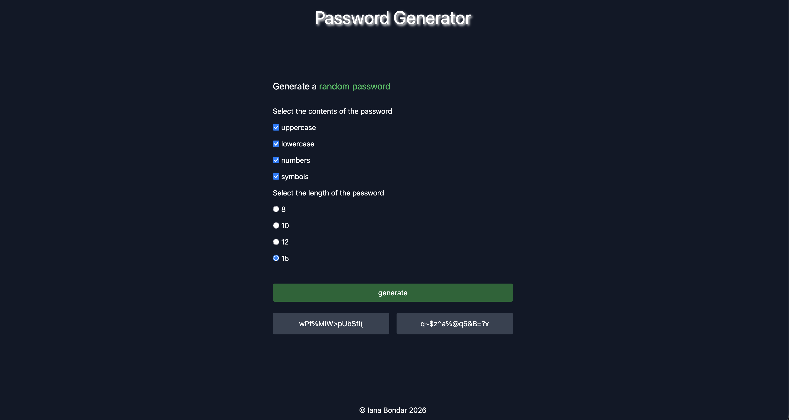

# Password Generator

This simple web app generates random passwords based on user-selected criteria such as the password length and the type of characters that would be included in the password.

## Live Demo and Preview

[Click here to try it out!](https://ianabond.github.io/password-generator/)

## Features

- Generate random passwords
- Select character types (uppercase, lowercase, numbers, symbols)
- Choose password length
- Copy passwords to clipboard
- Input validation (requires at least one selection)
- Responsive layout

## Tools Used

- HTML
- CSS (Tailwind)
- JavaScript